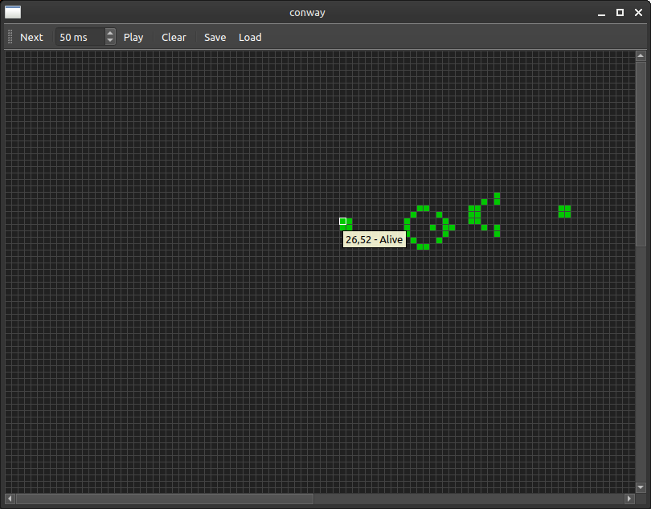

# Conway's game of life

Simple implementation of Conway's game of life.
Can save and load images (bmp, xbm, xpm). White or transparent pixel is dead cell, anything else is alive.

Can edit directly on the board:
- Mouse Hover shows coordinates and cell status
- Left click sets cell alive
- Right click sets cell dead
- Dragging with mouse button pressed sets multiple cells

## Dependencies:
- Qt5
